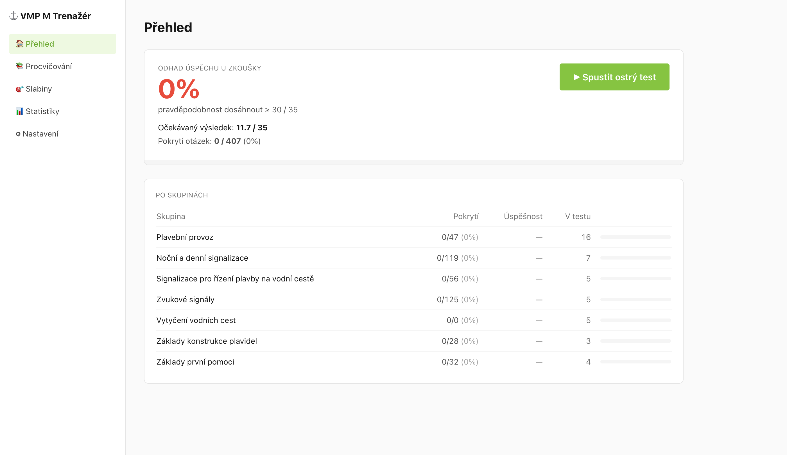

# VMP M Trenažér

Lokální webová appka na trénink otázek pro zkoušku VMP M (Vůdce malého plavidla, kategorie M 2015).



## Setup (jednorázově)

```bash
pnpm install
pnpm scrape          # stáhne otázky a obrázky ze spspraha.cz
cp .env.local.example .env.local
# Edituj .env.local — nastav VITE_PROJECT_ROOT na absolutní cestu k tomuto folderu
```

## Spuštění

```bash
pnpm dev
```

Otevře se `http://localhost:5400`.

Případně dvojklik na `~/Desktop/VMP-Trainer.command` — spustí dev server, počká až nastartuje, a otevře prohlížeč. Zavřením okna Terminálu se server vypne.

## Cowork skill (volitelně, pro AI vysvětlení)

1. `pnpm package-skill` — vytvoří `dist-skill/explain-vmp-question.zip`
2. Otevři Claude Desktop → **Cowork** → **Customize** → **Skills** → **Upload** → vyber ten ZIP.
3. **Projects** → **Import existing** → vyber tento folder.
4. Project instructions: *"Když uživatel požádá o vysvětlení otázky, použij skill explain-vmp-question."*

V appce klikni "🧠 Vysvětlení" u otázky → otevře Cowork s předvyplněným promptem.

## Módy

- **Ostrý test** — 35 otázek, 30 minut, struktura 16/7/5/3/4
- **Procvičování** — buď struktura ostrého testu (bez timeru), nebo vlastní výběr oblastí
- **Slabiny** — automaticky vybere 20 otázek které pleteš
- **Statistiky** — úspěšnost po skupinách + historie testů

Progress je v localStorage prohlížeče. Vysvětlení se commitují do `public/explanations/`.

## Skripty

| Skript | Co dělá |
|---|---|
| `pnpm dev` | dev server (vite) |
| `pnpm build` | produkční build do `dist/` |
| `pnpm test` | spustí vitest |
| `pnpm scrape` | jednorázový scraper otázek |
| `pnpm package-skill` | zazipuje Cowork skill do `dist-skill/` |
